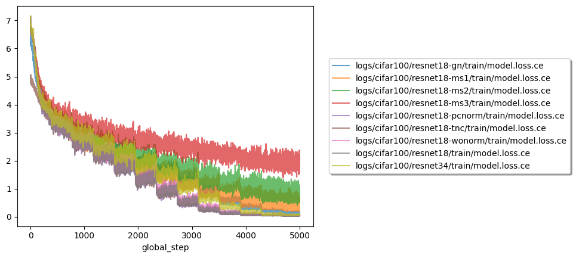
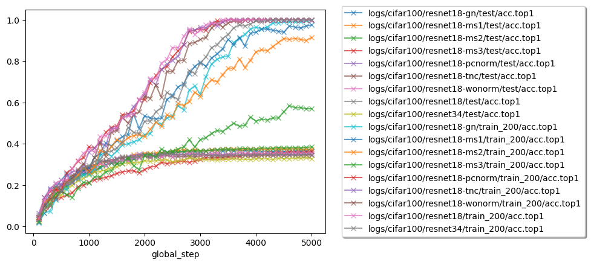
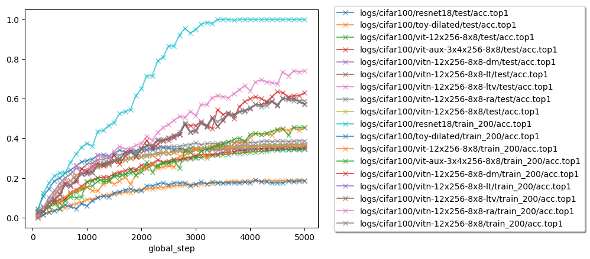

# Image Classification

Compare some image classification models.

## Clone

```
git clone  --recurse-submodules https://github.com/enhuiz/image-classification.git
```

## Run

```bash
python -m src.train yaml=config/cifar100/resnet18.yml
```

Where `config/cifar100/resnet18.yml` can be any configuration you want to run.

## Plot

```bash
bash ./scripts/plot.sh
```

## Summary

```bash
python -m src.summary
```

## Figures

### Compare Different ResNet Settings





#### Insights

- It appears that the ResNet model severely overfits on the CIFAR100 dataset. Models with lower training accuracy have larger test accuracy.
- The Mix-style method [1] helps alleviate this overfitting clearly.

#### Puzzles

- Why does the loss suddenly drop periodically (after each epoch) for ResNet? Is it because of memorization?

### Compare Different Models




### Compare Different Learning Strategies


## Tables

#### Train Subset Results

| path                                         | split     | step | top1_acc |
| :------------------------------------------- | :-------- | ---: | -------: |
| logs/cifar100/resnet18-tnc/1673197467        | train_200 | 3700 |        1 |
| logs/cifar100/resnet18/1673166948            | train_200 | 4800 |        1 |
| logs/cifar100/resnet34/1673168398            | train_200 | 5000 |        1 |
| logs/cifar100/resnet18-wonorm/1673167005     | train_200 | 4400 |        1 |
| logs/cifar100/resnet18-clr1e-4/1673254216    | train_200 | 5000 |        1 |
| logs/cifar100/resnet18-pcnorm/1673174156     | train_200 | 4400 |        1 |
| logs/cifar100/resnet18-gn/1673170157         | train_200 | 5000 |    0.995 |
| logs/cifar100/resnet18-ms1/1673171756        | train_200 | 5000 |    0.975 |
| logs/cifar100/resnet18-ms2/1673170222        | train_200 | 5000 |    0.915 |
| logs/cifar100/resnet18-ms3/1673171761        | train_200 | 4600 |    0.585 |
| logs/cifar100/vit-12x256-8x8/1673178974      | train_200 | 4800 |    0.455 |
| logs/cifar100/vit-aux-3x4x256-8x8/1673196895 | train_200 | 4800 |    0.455 |
| logs/cifar100/resnet18-aug/1673255003        | train_200 | 4200 |    0.405 |
| logs/cifar100/toy-dilated/1673172683         | train_200 | 4100 |     0.19 |

#### Test Set Results

| path                                         | split | step | top1_acc |
| :------------------------------------------- | :---- | ---: | -------: |
| logs/cifar100/resnet18-aug/1673255003        | test  | 5000 |   0.4077 |
| logs/cifar100/resnet18-ms2/1673170222        | test  | 5000 |   0.3851 |
| logs/cifar100/resnet18-ms1/1673171756        | test  | 4700 |   0.3768 |
| logs/cifar100/resnet18-gn/1673170157         | test  | 3500 |   0.3703 |
| logs/cifar100/resnet18-ms3/1673171761        | test  | 5000 |   0.3617 |
| logs/cifar100/vit-aux-3x4x256-8x8/1673196895 | test  | 4700 |   0.3575 |
| logs/cifar100/resnet18-wonorm/1673167005     | test  | 3700 |   0.3572 |
| logs/cifar100/resnet18/1673166948            | test  | 2400 |   0.3539 |
| logs/cifar100/resnet18-pcnorm/1673174156     | test  | 2800 |   0.3519 |
| logs/cifar100/resnet18-tnc/1673197467        | test  | 4400 |   0.3477 |
| logs/cifar100/vit-12x256-8x8/1673178974      | test  | 5000 |    0.345 |
| logs/cifar100/resnet34/1673168398            | test  | 2800 |   0.3338 |
| logs/cifar100/resnet18-clr1e-4/1673254216    | test  | 2000 |   0.3184 |
| logs/cifar100/toy-dilated/1673172683         | test  | 4900 |   0.1886 |

## References

[1] https://github.com/KaiyangZhou/mixstyle-release
