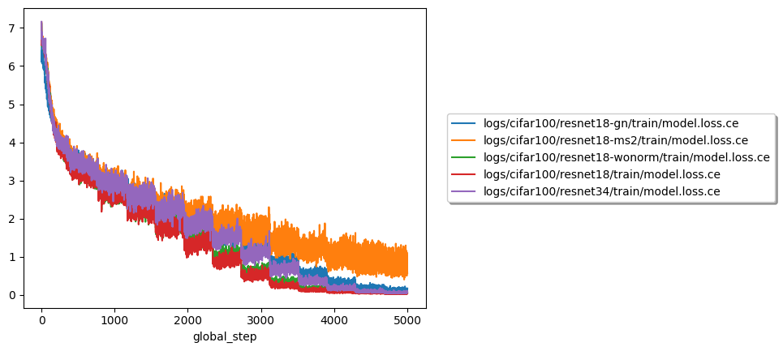

# Image Classification

Compare some image classification models.

## Clone

```
git clone  --recurse-submodules https://github.com/enhuiz/image-classification.git
```

## Run

```bash
python -m src.train yaml=config/cifar100/resnet18.yml
```

Where `config/cifar100/resnet18.yml` can be any configuration you want to run.

## Plot

```bash
bash ./scripts/plot.sh
```

## Results

### ResNets

#### Figures




#### Table

| path                                     | split | step | top1_acc |
| :--------------------------------------- | :---- | ---: | -------: |
| logs/cifar100/resnet18-ms2/1673170222    | test  | 5000 |   0.3851 |
| logs/cifar100/resnet18-gn/1673170157     | test  | 3500 |   0.3703 |
| logs/cifar100/resnet18-wonorm/1673167005 | test  | 3700 |   0.3572 |
| logs/cifar100/resnet18/1673166948        | test  | 2400 |   0.3539 |
| logs/cifar100/resnet34/1673168398        | test  | 2800 |   0.3338 |

| path                                     | split     | step | top1_acc |
| :--------------------------------------- | :-------- | ---: | -------: |
| logs/cifar100/resnet18-wonorm/1673167005 | train_200 | 4400 |        1 |
| logs/cifar100/resnet34/1673168398        | train_200 | 4700 |        1 |
| logs/cifar100/resnet18/1673166948        | train_200 | 4400 |        1 |
| logs/cifar100/resnet18-gn/1673170157     | train_200 | 4900 |    0.995 |
| logs/cifar100/resnet18-ms2/1673170222    | train_200 | 5000 |    0.915 |

## Insights

- TODO

## Puzzles

- Why does the loss suddenly drop periodically (after each epoch)?
