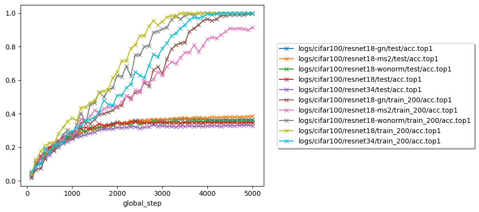

# Image Classification

Compare some image classification models.

## Clone

```
git clone  --recurse-submodules https://github.com/enhuiz/image-classification.git
```

## Run

```bash
python -m src.train yaml=config/cifar100/resnet18.yml
```

Where `config/cifar100/resnet18.yml` can be any configuration you want to run.

## Plot

```bash
bash ./scripts/plot.sh
```

## Results




## Insights

- TODO

## Puzzles

Why does the loss suddenly drop periodically (after each epoch)?
